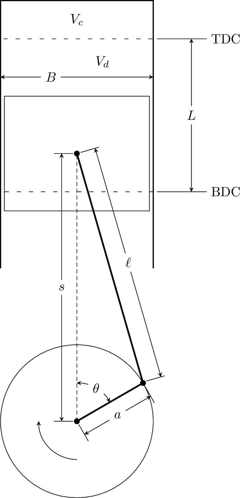

.. _sec-icengine:

================================
Internal Combustion Engine Model
================================

The internal combustion engine model in CanSen is included to enable 
simulations of a reciprocating internal combustion engine. The 
equation of motion for the piston follows from [#HEYW1988]_, Ch. 2.

Assuming the piston roughly appears as:

   
where :math:`s` is distance from the crank axis to the piston pin axis, 
:math:`\ell` is the connecting rod length, :math:`a` is the crank radius, 
:math:`\theta` is the crank angle, with :math:`0^{\circ}` at the top of 
the crank, :math:`L` is the stroke length, :math:`B` is the cylinder bore, 
:math:`V_d` is the swept, or displacement, volume, :math:`V_c` is the 
clearance volume, and TDC and BDC are top dead center and bottom dead center 
respectively (i.e. the top and bottom of the stroke).

The compression ratio of the cylinder is defined as:

.. math::
    r_c = \frac{V_d + V_c}{V_c}
    
The swept volume can either be specified directly, or can be calculated from
the cylinder bore and stroke length:

.. math::
    V_d = L * \pi * \frac{B^2}{4}
    
The initial volume of the cylinder (the volume at BDC) is:

.. math::
    V_0 = V_d + V_c = r_c * V_c = \frac{V_d}{r_c - 1} + V_d

====

The distance from the crank center to the piston pin is given by:

.. math::
    s = a \cos(\theta) + \sqrt{\ell^2 - a^2 \sin^2(\theta)}

Cantera expects a moving wall to be given a velocity, so we find the piston 
velocity by differentiating with respect to time:

.. math::
    \frac{ds}{dt} = -a \sin(\theta) \frac{d\theta}{dt} + \frac{a^2 \sin(\theta) \cos(\theta)\frac{d\theta}{dt}}{\sqrt{\ell^2 - a^2 \sin^2(\theta)}}
    
Defining :math:`\frac{d\theta}{dt}`, the angular velocity of the crank, as 
:math:`\omega`, and using the definition of the stroke length :math:`L` and 
the connecting rod length to crank radius ratio :math:`R`:

.. math::
    L = 2a \\
    R = \frac{\ell}{a}

the equation for the velocity can be simplified to:

.. math::
    \frac{ds}{dt} = -\omega \frac{L}{2} \sin(\theta) \left[1 + \frac{\cos(\theta)}{\sqrt{R^2 - \sin^2(\theta)}}\right]

In CanSen, the angular velocity of the crank is input in revolutions per 
minute, so it must be converted to radians per second:

.. math::
    \frac{rad}{s} = RPM * \frac{\pi}{30}
    

                    
.. [#HEYW1988] John B. Heywood. *Internal Combustion Engine Fundamentals.* New York: McGraw Hill, 1988. Print.